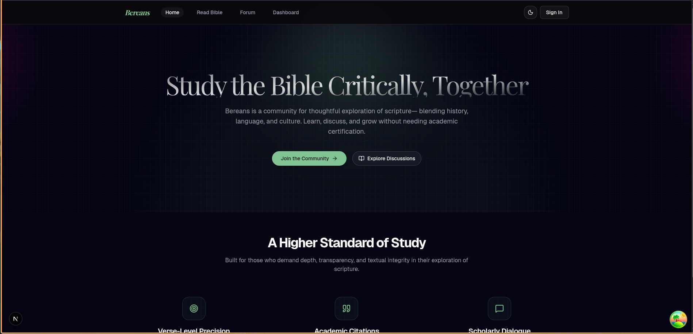
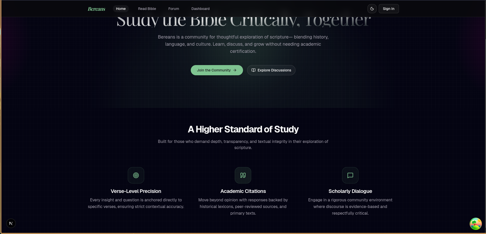
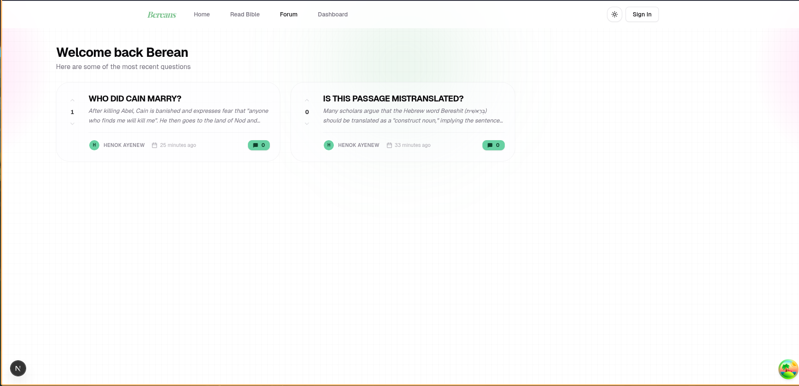
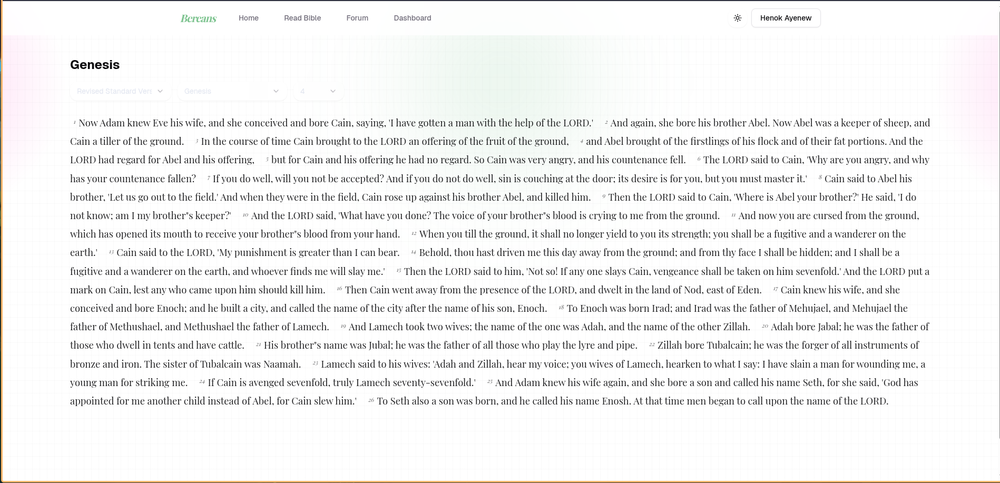
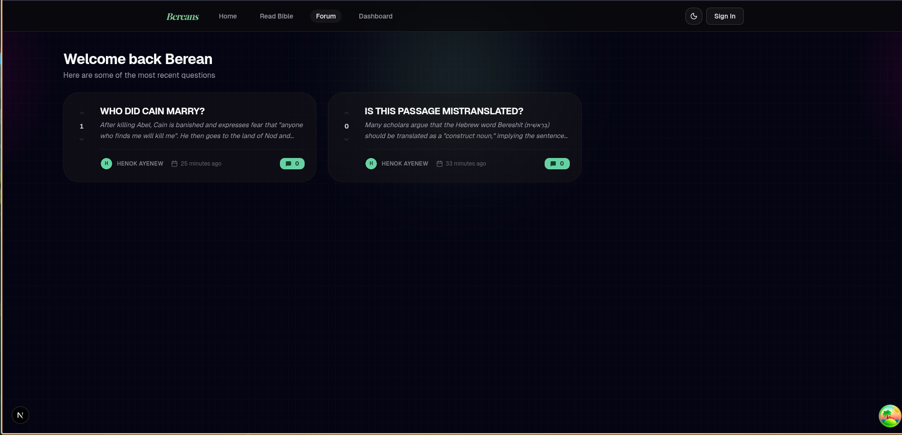
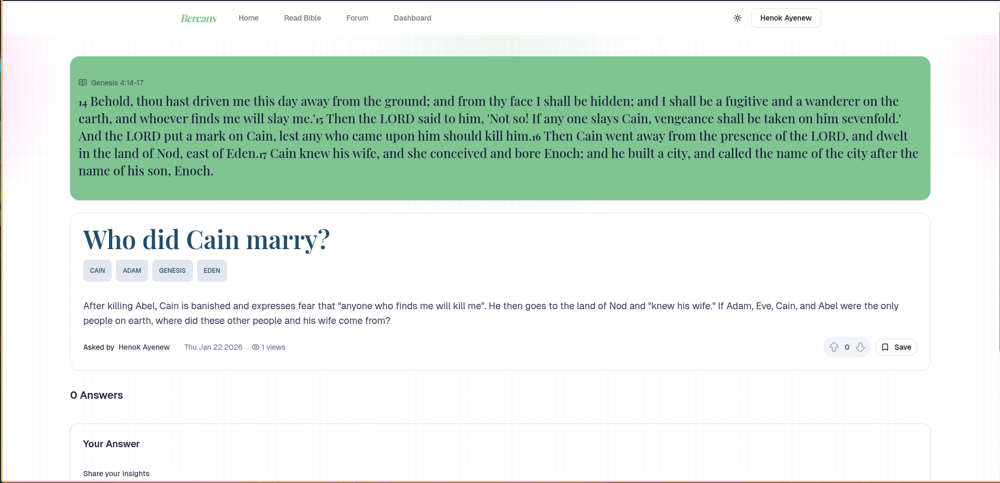
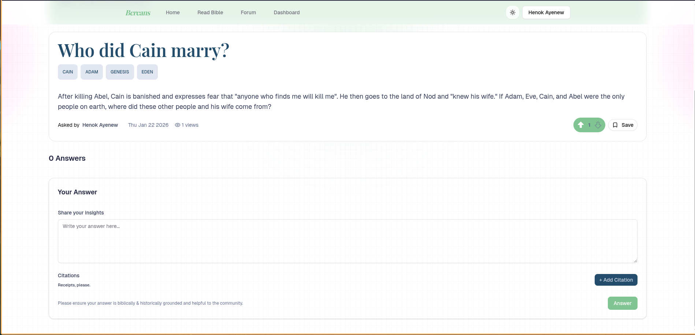
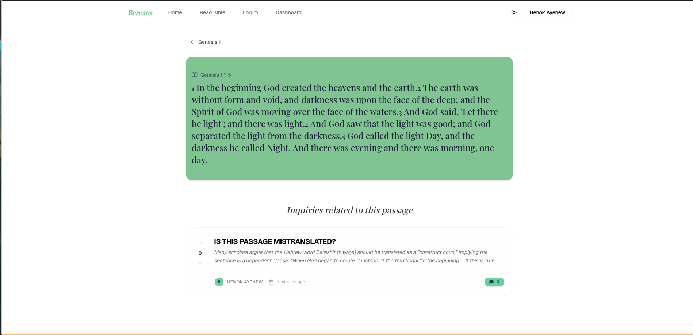
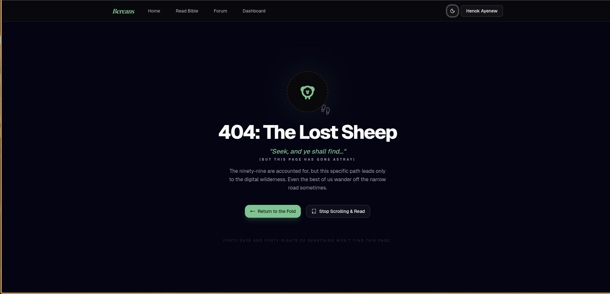

# Bereans Bible Discussion App



Welcome to the Bereans Bible Discussion App, inspired by the diligent spirit of the Bereans in **Acts 17:10-11**:  
*"Now the Bereans were of more noble character than those in Thessalonica, for they received the message with great eagerness and examined the Scriptures every day to see if what Paul said was true."*

This app is designed to facilitate robust, verse-by-verse discussions on Bible passages. Each question and answer is grounded in citations from credible academic sources, fostering more rigorous, trustworthy conversations – no more "trust me bro" answers!

---

## ✨ Features

- **Beautiful Bible Reader UI** 
- **Ask Questions on Specific Verse Ranges**
- **View All Questions on Any Verse or Passage**
- **Support for Multiple Bible Translations**  
  *Including the Septuagint!*
- **Citations for Every Answer**  
  Answers can be supported with references to authoritative works, commentaries, or scholars.
- **Personal Activity Dashboard**  
  See all your questions, answers, and citations at a glance.

---

## 📝 Example Use Cases

- Ask challenging or curious questions about any passage.
- Browse and filter all questions on a chapter.
- Cite NT Wright, John Stott, academic commentaries, or other credible experts in answers.

---

## 🚀 Quickstart

1. **Clone this Repository:**
   ```bash
   git clone https://github.com/yourusername/bereans-bible-app.git
   cd bereans-bible-app
   ```

2. **Install Dependencies:**
   ```bash
   npm install
   # or
   yarn install
   ```

3. **Run the App Locally:**
   ```bash
   npm start
   # or
   yarn start
   ```

4. **Enjoy verse-by-verse discussions the Berean way!**

---

## 🙏 Why This App?

Whenever you read the Bible, questions arise. Too often, online discussions lack depth or credible references. This app brings you:

- Rigorous, citation-backed discussion.
- Community-driven insights on any passage.
- The spirit of the Bereans: eager to learn, always searching Scripture!

---

## 📚 Contributing

1. Fork the repo and clone it.
2. Make your changes.
3. Open a pull request with details.

Contributions are welcome, especially from those passionate about rich, respectful Bible study!

---

## 📷 Screenshots

|  |  |  |
|:---:|:---:|:---:|
| Bible Reader UI | Ask a Question | Questions on Passage |

|  |  |  |
|:---:|:---:|:---:|
| Translations | Research Citation | Dashboard |

|  |  |  |
|:---:|:---:|:---:|
| Ask on Passage | Filtered Questions | Academic Citations |

|  |
|:---:|
| Berean Discussion |

---

## 📖 License

MIT License

---

*Be a noble Berean. Study and discuss the Scriptures with rigor and joy!*