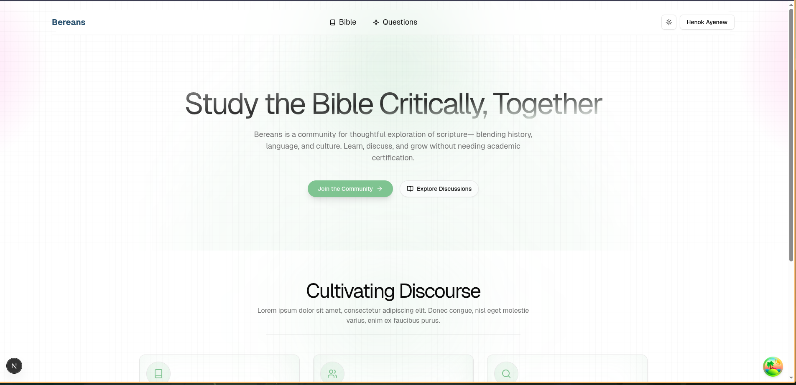
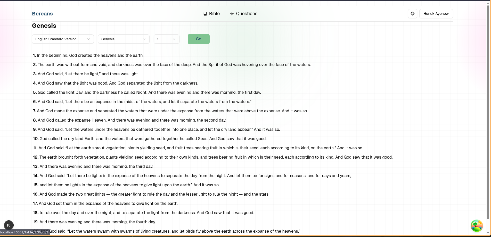
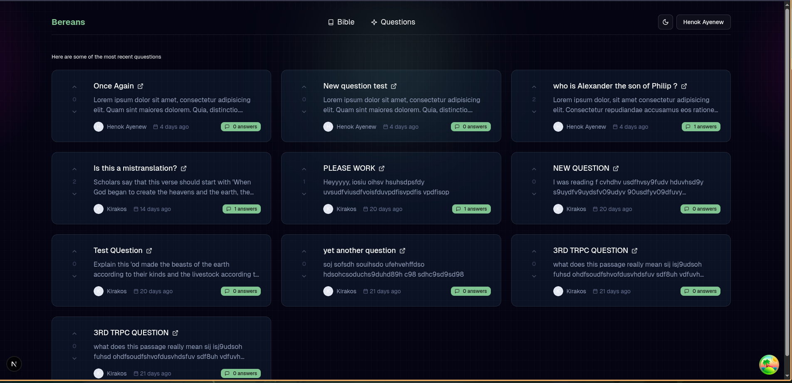
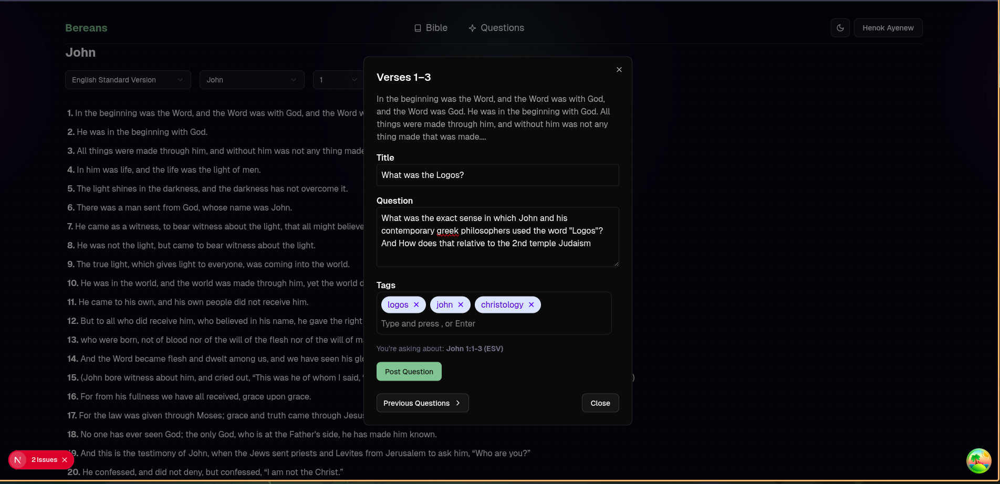
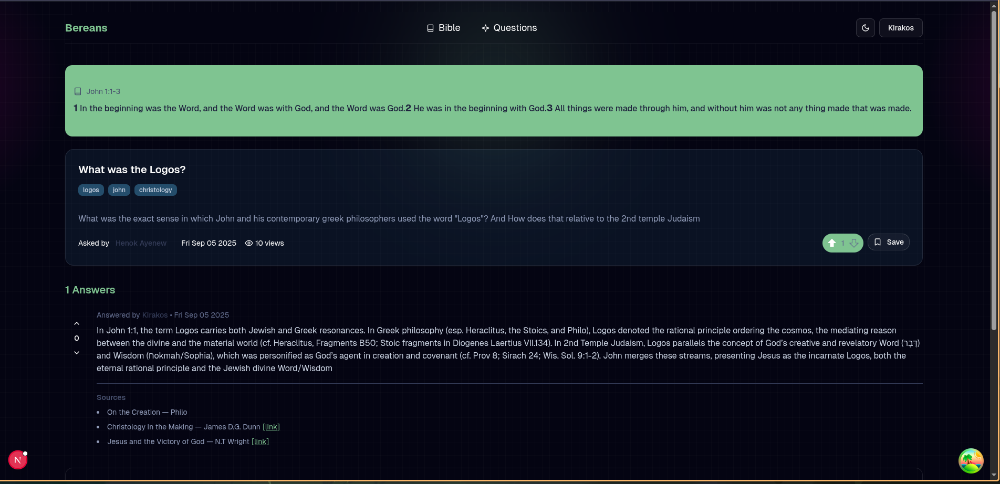

# Bereans

This is a platform for everybody interested in biblical studies to ask and answer questions, provide resources and cultivate spirited discussion. Here are some screenshots.






The project was initialized with [Better-T-Stack](https://github.com/AmanVarshney01/create-better-t-stack) monorepo, using NextJS ( both backend and frontend ), tRPC, Drizzle, SQLite(turso), shadcn/ui and TailwindCSS. To get it up and running on your local machine, clone the repo and install the dependencies:

```bash
git clone https://github.com/henacodes/bereans.git
npm install
```

## Database Setup

This project uses SQLite with Drizzle ORM.

1. Start the local SQLite database:

```bash
cd apps/server && npm run db:local
```

2. Update your `.env` file in the `apps/server` directory with the appropriate connection details if needed.

3. Apply the schema to your database:

```bash
npm run db:push
```

Then, run the development server:

```bash
npm run dev
```

Open [http://localhost:3001](http://localhost:3001) in your browser to see the web application.
The API is running at [http://localhost:3000](http://localhost:3000).

## Project Structure

```
my-better-t-app/
├── apps/
│   ├── web/         # Frontend application (Next.js)
│   └── server/      # Backend API (Next, TRPC)
```

## Available Scripts

- `npm run dev`: Start all applications in development mode
- `npm run build`: Build all applications
- `npm run dev:web`: Start only the web application
- `npm run dev:server`: Start only the server
- `npm run check-types`: Check TypeScript types across all apps
- `npm run db:push`: Push schema changes to database
- `npm run db:studio`: Open database studio UI
- `cd apps/server && npm run db:local`: Start the local SQLite database
